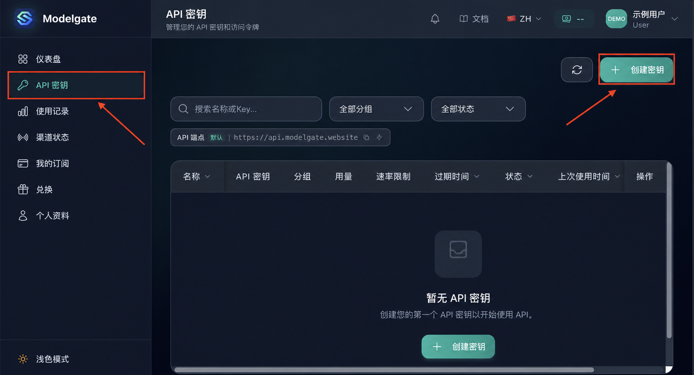
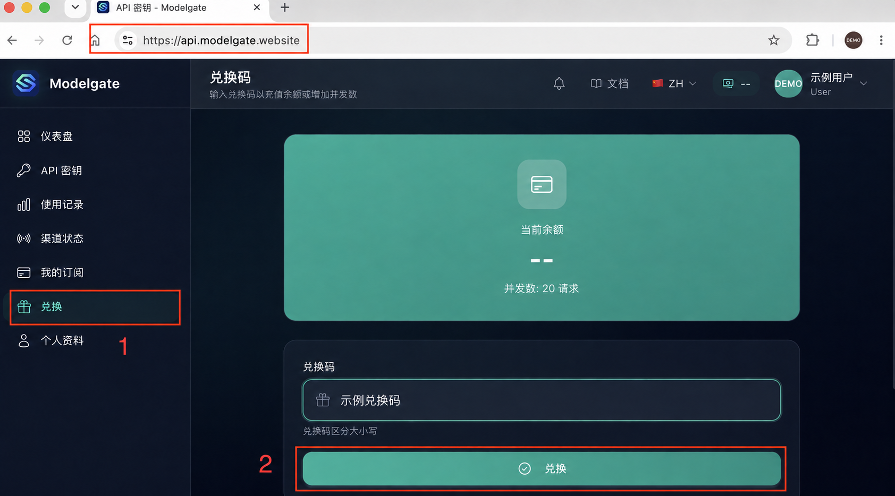
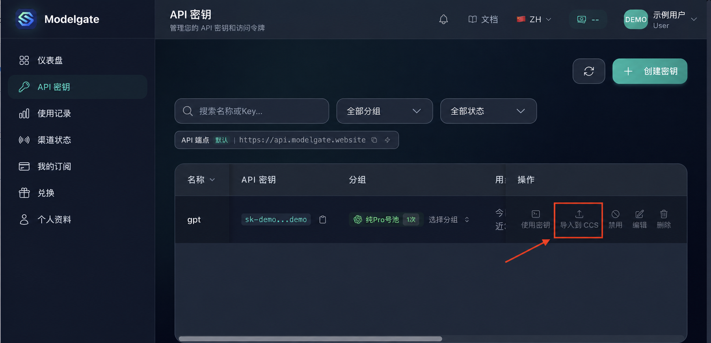
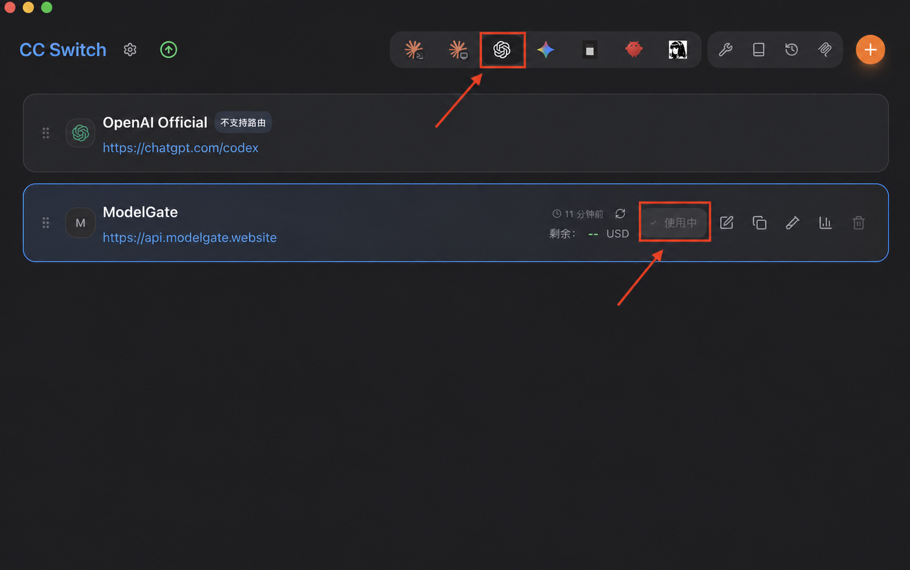

# 小黄AI中转站

注册、兑换额度、创建密钥，再通过 CC Switch 导入配置。

## 你可以用它做什么

| 清晰的接入路径 | CC Switch 快速导入 | 中文图文教程 |
| --- | --- | --- |
| 账号、额度、密钥集中管理 | 从控制台导入并启用配置 | 每一步都有脱敏截图可核对 |
| [进入 API 控制台](https://api.modelgate.website) | [下载 CC Switch](https://github.com/farion1231/cc-switch/releases) | [查看完整教程](docs/connection-guide.md) |

## 三步开始

1. 打开 [ModelGate API 控制台](https://api.modelgate.website)，注册并登录；需要额度时前往 [兑换码商店](https://shop.modelgate.website)。
2. 创建 API 密钥、选择对应号池，然后点击“导入到 CCS”。
3. 在 CC Switch 中启用配置，彻底退出并重新打开 Codex。

完整操作、安装地址和故障排查见 **[图文接入教程](docs/connection-guide.md)**，也可打开 **[宣传与教程页面](site/index.html)**。

<strong>展开查看接入截图</strong>

### 1. 兑换额度

### 2. 创建并导入密钥

### 3. 使用密钥

### 4. 在 CC Switch 中启用

